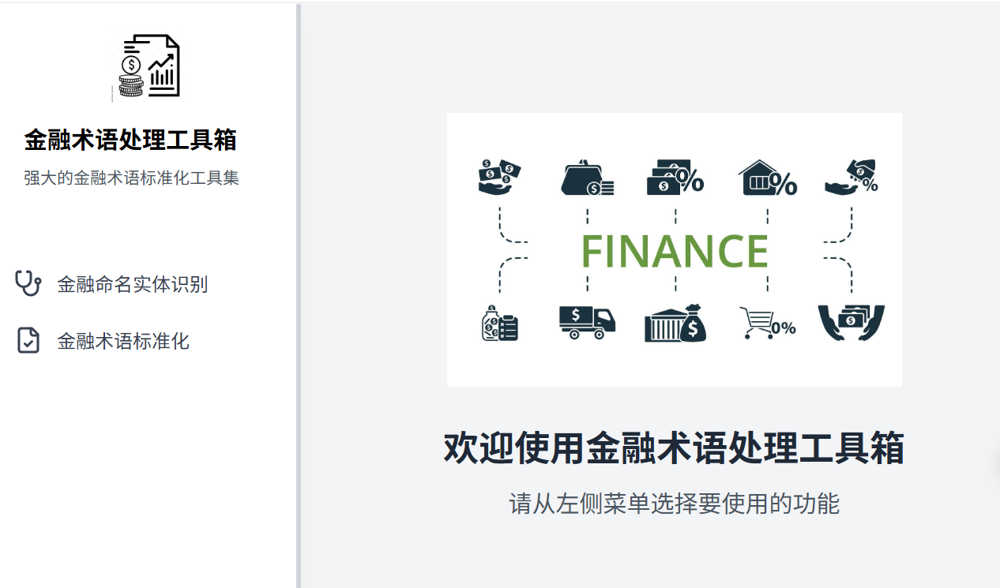

# 金融网站项目 

一个使用 Next.js 和 Tailwind CSS 构建的现代化、金融术语标准化的服务平台。 
<a href="https://u.geekbang.org/subject/airag/1009927"> 极客时间RAG进阶训练营</a>

学习链接： https://u.geekbang.org/subject/airag/1009927 





## 功能特点


## 技术栈

- **前端框架**: Next.js
- **样式**: Tailwind CSS
- **状态管理**: React Context
- **表单处理**: React Hook Form
- **API 集成**: RESTful APIs

## 开始使用

1. 克隆仓库
2. 安装依赖：
   ```bash
   npm install
   ```
3. 运行开发服务器：
   ```bash
   npm start
   ```
4. 在浏览器中打开 [http://localhost:8000](http://localhost:8000)

## 许可证

本项目采用 MIT 许可证 - 查看 LICENSE 文件了解详情